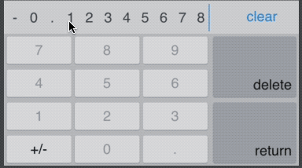
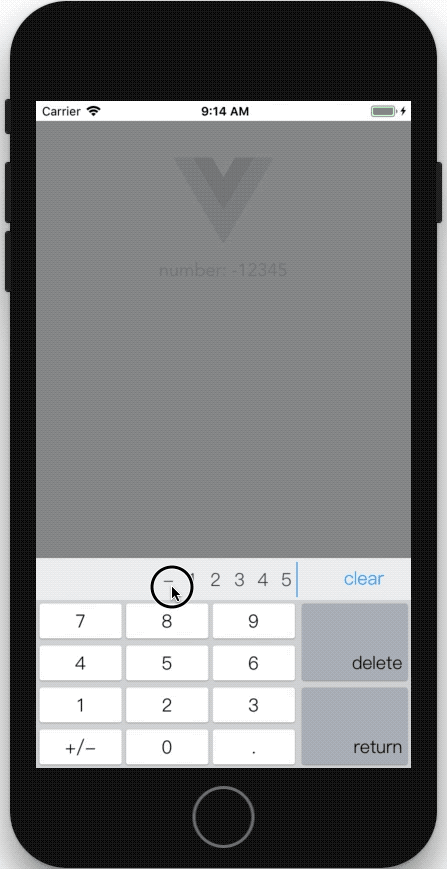
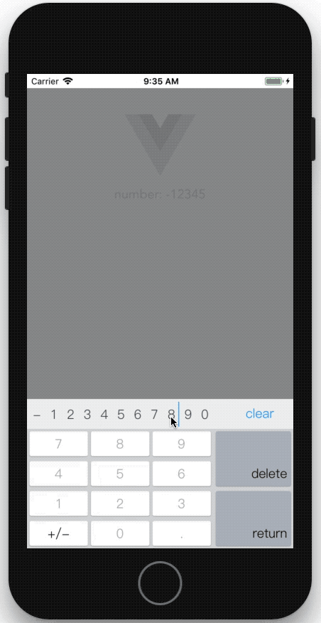

# vue-input-keyboard
以数字为主的键盘模拟组件，且内置有效性验证，优化输入互动逻辑，提高用户的输入效率。

[demo](http://jsfiddle.net/wanyaxing/41mzw0Ly/embedded/result,html,js/)




## 基础特性：
* 支持输入常规的数字值，支持负数，支持小数。
* 支持触控屏操作
* 支持 清除、删除和确认操作。delete （回退一格）、 clear （清空文本区）、 return （提交）
## 高级特性：
* 替换指定位数字：按住文本区字符后鼠标（或手指）移动到按键区的按键上释放，则使用目标按键的字符替换当前字符。
    * 如果是在 delete 键上释放，则为删除当前字符。（和直接点击删除键效果一致）
    
* 支持光标锚点移动：
    * 点击文本区字符则光标定位到改字符右侧（此时点击删除会删除光标左侧的字符即当前字符）
        * 按住文本区字符鼠标（或手指）在文本区滑动，光标也会随之移动。
    * 点击文本区左侧的空白区域则光标定位到首位字符左侧（当光标左侧没有字符时，点击删除键会删除首位字符）
    
* 预测数值有效性并动态展示按键的可点击状态


## 永无止尽的细节探索
* 如果数值范围不包含0，这个问题很复杂，不过，搞定了，现在可以智能判断哪些键可用，一步步引导用户去输入数字最终达到有效范围之内。
* 如果初始值不是一个有效值怎么办？标红，要么你就放弃修改，否则请手动修正重做，反正不准提交，
* 自动优化首位为0或点号的各种奇葩情况，比如1000删除首位1之后应该归位为一个0，比如0.01删除首位0会怎样？
* 再强调下，什么情况下什么键可以点还是不可以点，这个问题太复杂了，目前大部分场景已搞定。
* 光标锚点也分左右哦，左侧光标只支持首位情况下存在，不管光标是在文字左侧还是右侧，插入文字或替换都以光标的左侧区域为准。
* disabled 的属性值可以是空，可以是true，可以是1，反正都支持。
* 如果属性 min 大于 max 会怎样？我觉得应该智能判断，允许这种特殊情况，不都这说么字文序顺不响影阅读嘛。
* 换句话说，min值和max值在设置属性时也不必强行设定为数字，字符串也认的，反正就是让你懒得去计较这些细节就是，懒是科学发展之父。
* 虽然我用中文写了巴拉巴拉这么一大堆说明，但我还是有点小期盼，这个插件能供更多场景使用，所以在英文环境下，对应的操作按键文字是 clear / delete / return 。
* 如果说5201314会怎样？全世界都应该懂中国话。


## 待完成的更多特性：
    √ 支持初始值超出有效性的情况警告
    □ 支持键盘快捷键
    □ 支持手机号码输入和验证
    □ 支持身份证号码输入和验证（注：还要支持特殊字符X的处理）
    □ 支持自定义字符输入和验证
    □ 支持基础的计算功能，如加减乘除
    □ 支持自定义 return / delete / clear 按钮的文字
    □ 支持自定义高级按钮（如自定义增加步进增减按钮）
    □ 支持自定义指令v-inputkeyboard应用于任意元素或组件
    □ 支持PC网页里键盘动态位置展示
    □ ...


## props

| property         |            type             | default      | description                                     |
| ---------------- | :-------------------------: | :----------: | ----------------------------------------------- |
|  min             |   String,Number             | -99999999999 |  max or min                                     |
|  max             |   String,Number             |  99999999999 |  max or min                                     |
|  maxlength       |   String,Number             |  11          |  (1-11)                                         |
|  decimals        |   String,Number             |  0           |  (0-9)                                          |
|  disabled        |   String,Boolean,Number     |  false       |  css class : input_disabled                     |
|  readonly        |   String,Boolean,Number     |  false       |  css class : input_readonly                     |
|  placeholder     |   String                    |  '...'       |                                                 |
|  v-model         |   Number                    |  0           |                                                 |
|  value           |   Number                    |  0           |                                                 |


## NPM
```html
#install

npm install vue-input-keyboard --save

# main.js

import Vue from 'vue'
Vue.use(require('vue-input-keyboard'))

# example.vue

<inputkeyboard v-model="item.age" min="0" max="110" decimals="0" placeholder="??"/>
```

## Browser
```html
<body>
<div id="app">
<div>[HOME]</div>
<center>
    number:<inputkeyboard v-model="number" :decimals="2" placeholder="click to enter"/>
</center>
</div>

<script src="https://cdn.jsdelivr.net/npm/vue"></script>
<script src="https://npmcdn.com/vue-input-keyboard/dist/index.min.js"></script>

<script>
new Vue({
    el: '#app',
    data() {
        return {
            number: -12345,
        }
    },
    methods: {

    }
})

</script>
</body>
```

## DEVELOP

* git clone & init
```
    npm install
```
* code & build
```
    npm run build
```


## License

MIT

